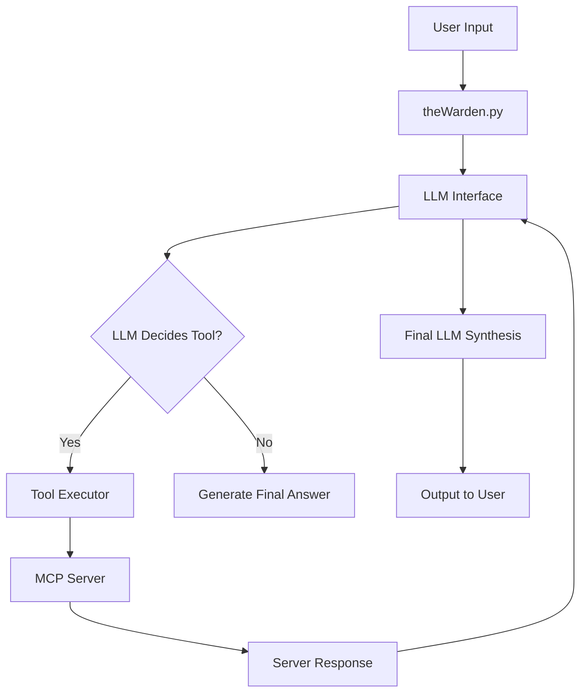

# The Warden Documentation

Welcome to **The Warden**, an autonomous SOC assistant powered by LLM-driven reasoning and a pluggable Multi-Channel Protocol (MCP) framework.

---

## Table of Contents

- [Overview](#overview)
- [Project Structure](#project-structure)
- [Core Components](#core-components)
- [System Architecture](#system-architecture)
- [Operational Guides](#operational-guides)
- [Development and Utilities](#development-and-utilities)

---

## Overview

### Purpose of The Warden

The Warden is built to:

- Aggregate threat intelligence
- Process data autonomously
- Provide actionable risk assessments
- Query and correlate across multiple intel providers
- Integrate seamlessly with MCP-based servers
- Automate SOC analysis and daily workflows

---

## Project Structure

```
the-warden/
├── theWarden.py
├── llm_interface.py
├── mcp_manager.py
├── tool_executor.py
├── mcp_server_config.json
│
├── servers/
│   ├── abuseIP_mcp_server.py
│   ├── threatFox_mcp_server.py
│   └── elastic_mcp_server.py
│
├── tools/
│   ├── intel_providers.py
│   └── tool_schema.py
│
├── examples/
│   ├── test_mcp.py
│   ├── sampleElasticData.py
│   └── api_check.py
│
└── documentation/
    └── (this folder)
```

---

## Core Components

### theWarden.py — Core Orchestrator

`theWarden.py` is the heart of the system. It:

- Accepts user prompts
- Routes requests through the LLM
- Loads available MCP servers
- Executes required tools
- Formats final responses

#### Runtime Flow

1. **User input enters the Warden**
2. The prompt is passed to the LLM (via `llm_interface`)
3. The LLM determines:
   - Which tools are needed
   - What order they should run in
4. `tool_executor` runs all requested tools
5. Results are returned to the LLM for synthesis
6. Final output is delivered to the user

#### Primary Responsibilities

| Responsibility | Description |
|---------------|-------------|
| Input handling | Command-line arg or interactive prompt |
| Orchestration | Coordinates all system components |
| LLM decision routing | Calls `llm_interface` |
| Tool invocation | Calls `tool_executor` |
| MCP server loading | Uses `mcp_manager` |
| Final message formatting | Clean human-readable output |

#### Key Functions

**`load_mcp_servers()`**  
Loads all configured MCP endpoints from JSON.

**`process_prompt(prompt)`**  
Runs full LLM pipeline and returns final output.

**`interactive_mode()`**  
Provides a REPL-style command line experience.

#### Usage Examples

**Interactive Mode**
```bash
python3 theWarden.py
```

**One-shot Query**
```bash
python3 theWarden.py "Investigate IP 185.220.101.1"
```

---

### llm_interface.py — LLM Decision Engine

This module is the **intelligence layer** that allows The Warden to:

- Interpret user intent
- Reason about threats
- Decide which tools to call
- Format structured tool-call requests
- Synthesize final human-facing answers

#### Responsibilities

| Component | Purpose |
|----------|---------|
| Prompt building | Wraps user message with system rules |
| LLM API wrapper | Calls Qwen3/OpenAI with retries |
| Tool-call interpreter | Converts LLM JSON into Python dict |
| Output generator | Human-readable summarization |

#### Key Functions

**`query_llm(prompt, context)`**  
Main interface to the LLM.

**`extract_tool_requests(response)`**  
Reads the LLM's JSON structure and identifies tool execution steps.

**`generate_final_answer(tool_results, original_prompt)`**  
Formats the final SOC-style output.

#### LLM Responsibilities

The LLM must determine:
- Which MCP tools are required
- In what order
- With which arguments

The LLM returns something like:

```json
{
  "action": "tool_call",
  "tool": "check_ip_reputation",
  "arguments": { "ip": "185.220.101.1" }
}
```

---

### tool_executor.py — Tool Execution Engine

`tool_executor.py` acts as the *router* between the LLM and the MCP servers.

Its job:  
**Take an LLM-requested tool → Validate → Forward to the correct MCP server → Return structured result.**

#### Responsibilities

- Parse LLM tool-calls
- Validate arguments against schema
- Match requested tool to the correct server
- Send JSON-RPC requests
- Handle errors, timeouts, and malformed responses
- Return clean objects for the LLM to interpret

#### Execution Flow

```
LLM → tool_executor → MCP Server → Response → LLM → Final Answer
```

#### Major Functions

**`execute_tool(tool_name, arguments)`**  
Main entry point. Determines which server handles a tool.

**`find_server_for_tool(tool_name)`**  
Ensures correct MCP server lookup.

**`call_mcp_server(server, method, params)`**  
Executes the actual HTTP/JSON-RPC request.

#### Return Format

Standardized return type:

```json
{
  "status": "success",
  "tool": "query_abuseipdb",
  "results": {...}
}
```

On failure:

```json
{
  "status": "error",
  "error": "Missing required argument 'ip'"
}
```

---

### mcp_manager.py — MCP Server Loader

`mcp_manager.py` manages:

- Loading MCP definitions from JSON
- Validating the configuration
- Providing lookup utilities
- Ensuring servers expose their required schemas

#### Responsibilities

| Scope | Description |
|-------|-------------|
| Config parsing | Reads `mcp_server_config.json` |
| Server registry | Maintains a map of tool → serverURL |
| Validation | Ensures all entries are well-defined |
| Runtime access | Provides server info to tool_executor |

#### Server Registration Model

Each server in your config looks like:

```json
{
  "name": "abuse_ip",
  "url": "http://127.0.0.1:8001",
  "tools": ["check_ip_reputation"]
}
```

`mcp_manager` loads these and exposes:

**`get_server_by_tool(tool_name)`**  
Returns the MCP endpoint responsible.

---

### mcp_server_config.json — MCP Server Registry

This JSON file defines all available MCP servers and the tools they expose.

#### Example Configuration

```json
{
  "servers": [
    {
      "name": "abuseIP",
      "url": "http://127.0.0.1:8001",
      "tools": ["check_ip_reputation"]
    },
    {
      "name": "threatFox",
      "url": "http://127.0.0.1:8002",
      "tools": ["lookup_ioc"]
    }
  ]
}
```

#### Field Explanations

| Field | Description |
|-------|-------------|
| name | Friendly identifier |
| url | MCP JSON-RPC endpoint |
| tools | Tool functions exposed by this server |

#### Why a JSON config?

- Hot-swappable MCP servers
- Add new intel source in 2 seconds
- No code changes required
- Clean decoupling between services

#### Validation Rules

`mcp_manager` ensures:

- No duplicate tool names
- Every server has a URL
- Every tool maps to exactly one server

---

## System Architecture

### Pipeline Overview

This section explains how data flows through the system.

#### High-Level Pipeline (Mermaid Diagram)



#### Explanation

1. **User provides input** — Warden accepts command-line or interactive prompt.
2. **LLM evaluates intent** — `llm_interface` constructs a system prompt.
3. **LLM may request tools** — If so, it returns JSON describing the tool name + arguments.
4. **Tool Executor runs MCP tools** — `tool_executor` routes commands to registered servers.
5. **MCP Servers return data** — Each operates independently (abuseIPDB, ThreatFox, Elastic, etc.).
6. **LLM synthesizes a final answer** — Returns a clean human-readable SOC summary.

#### Principles of the Pipeline

- Fully modular
- Add new tools without modifying core logic
- LLM decides usage dynamically
- Servers are isolated processes
- All results normalized

---

### How to Add a New MCP Tool Server

This guide shows how to add a new intel provider in **4 steps**.

#### Step 1 — Create new MCP Server File

Example: `servers/virustotal_mcp_server.py`

```python
from mcp import MCPServer

server = MCPServer("virustotal")

@server.tool("scan_hash")
def scan_hash(hash: str):
    ...
```

#### Step 2 — Register the server in mcp_server_config.json

```json
{
  "name": "virustotal",
  "url": "http://127.0.0.1:8003",
  "tools": ["scan_hash"]
}
```

#### Step 3 — Start the MCP server

Example:

```bash
python3 servers/virustotal_mcp_server.py
```

#### Step 4 — The Warden now automatically understands the tool

Example prompt:

```bash
Check reputation of file hash 2039abc987...
```

The LLM will figure out:

- **tool name:** `scan_hash`
- **arguments:** `{ hash: "..." }`
- **server:** `virustotal`
- **processing order**

No additional coding required.

---

## Operational Guides

### Launchd Setup on macOS — Auto-Start MCP Servers & Warden

This guide explains how to run:

- MCP servers
- The Warden itself
- Background networking scripts

automatically on macOS at boot using **LaunchAgents** or **LaunchDaemons**.

#### File Locations

**Per-user:**
```
~/Library/LaunchAgents/
```

**System-wide:**
```
/Library/LaunchDaemons/
```

#### Example LaunchAgent (run MCP server)

Save as: `~/Library/LaunchAgents/com.warden.abuseip.plist`

```xml
<?xml version="1.0" encoding="UTF-8"?>
<!DOCTYPE plist PUBLIC "-//Apple//DTD PLIST 1.0//EN"
"http://www.apple.com/DTDs/PropertyList-1.0.dtd">
<plist version="1.0">
 <dict>
   <key>Label</key>
   <string>com.warden.abuseip</string>

   <key>ProgramArguments</key>
   <array>
     <string>/usr/bin/python3</string>
     <string>/Users/YOU/security-lab/the-warden/servers/abuseIP_mcp_server.py</string>
   </array>

   <key>RunAtLoad</key>
   <true/>

   <key>KeepAlive</key>
   <true/>
 </dict>
</plist>
```

#### Load It

```bash
launchctl load ~/Library/LaunchAgents/com.warden.abuseip.plist
```

#### Unload

```bash
launchctl unload ~/Library/LaunchAgents/com.warden.abuseip.plist
```

#### View Running Jobs

```bash
launchctl list | grep warden
```

#### Debugging

Logs are visible in:

```bash
log stream --predicate 'process == "python3"'
```

---

## Development and Utilities

### Networking Scripts Overview

This section documents the networking utilities included in the repository.

#### setUp.sh

Used for:

- Installing Python dependencies
- Creating directories
- Setting permissions

Typical workflow:

```bash
chmod +x setUp.sh
./setUp.sh
```

#### install_dependencies.sh

Installs all required system + Python packages.

Example content:

```bash
pip install -r requirements.txt
```

#### Development Scripts

Scripts under `/examples` are NOT production tools — they exist for:

- Debugging MCP servers
- Checking API output
- Verifying connections to Elastic
- Ensuring tool schemas resolve correctly

**Examples:**

| Script | Purpose |
|--------|---------|
| test_mcp.py | Manually test a MCP endpoint |
| sampleElasticData.py | Query Elastic index |
| api_check.py | Quick JSON-format checker |

---

## Summary

The Warden provides a complete autonomous SOC assistant framework with:

- Modular MCP-based architecture
- LLM-driven tool orchestration
- Easy extensibility for new intel sources
- Automated deployment options for macOS
- Comprehensive development utilities

For questions or contributions, please refer to the project repository or contact the development team.